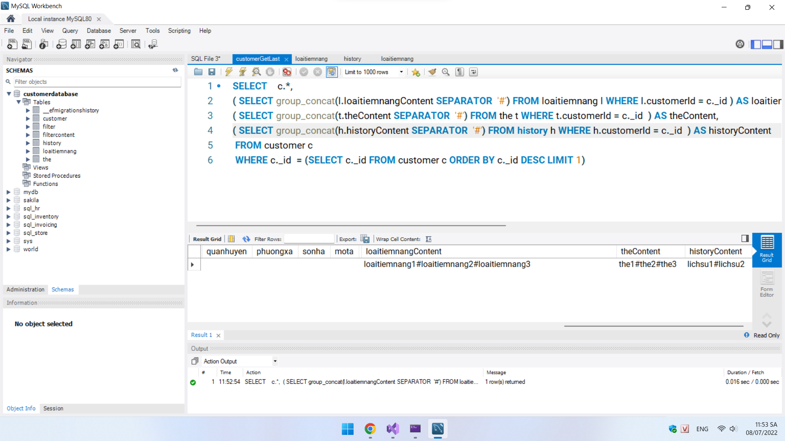
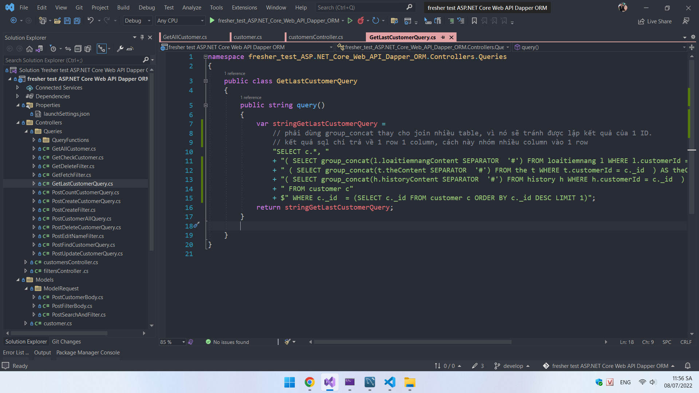

# Bài làm đề fresher test ReactJS-ASP.NET Core Web API Entity Framework-MySQL
- Phần client clone tại git này, thư mục client
https://github.com/tonguyenducmanh/fresher-test-NodeJS-ExpressJS
- Repository này chỉ bao gồm phần server, kết quả trả về hoàn toàn giống với kết quả từ server của repository fresher-test-ReactJS-ExpressJS-MongoDB

## Công cụ và công nghệ sử dụng

- API service: ASP.NET Core Web API
- Object Relational Mapper (ORM): Dapper
- Database: MySQL

## NUGET package

- Dapper
- MySQL.Data

## Sử dụng SubQueries do có nhiều bảng liên kết với bảng customer, giảm tải multi mapping sau khi query bằng dapper

## Kết quả trả về hoàn toàn tương tự như 2 project fresher-test còn lại
