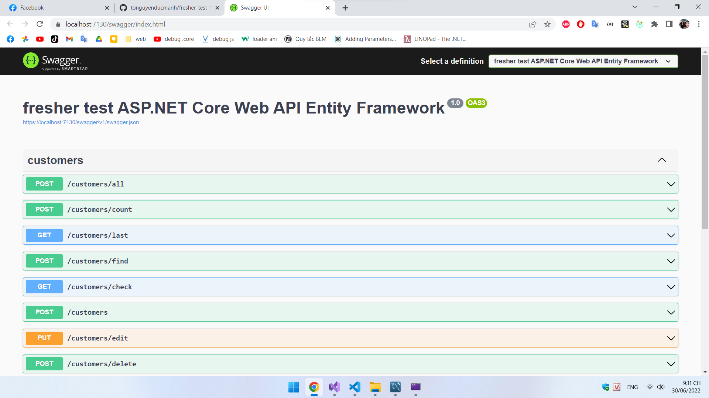
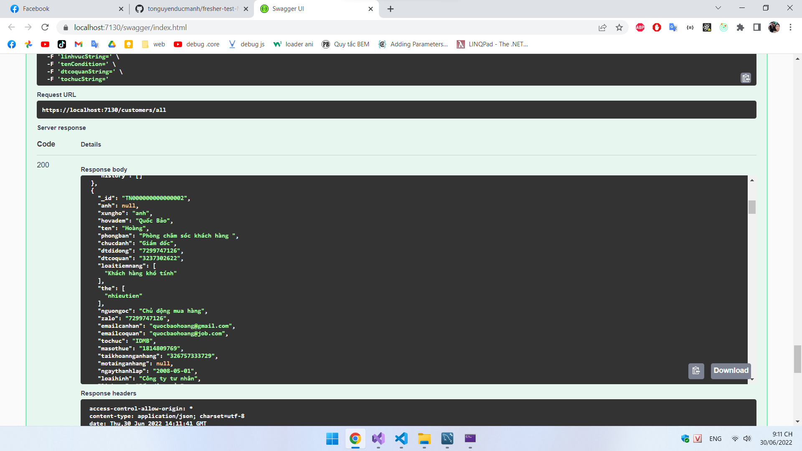
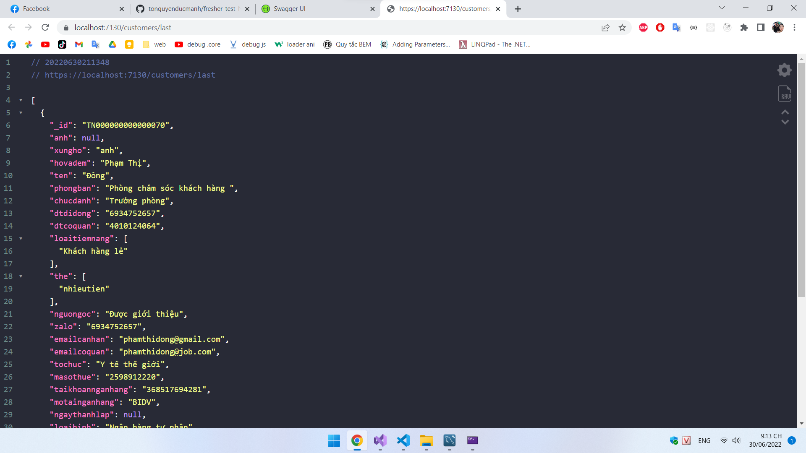
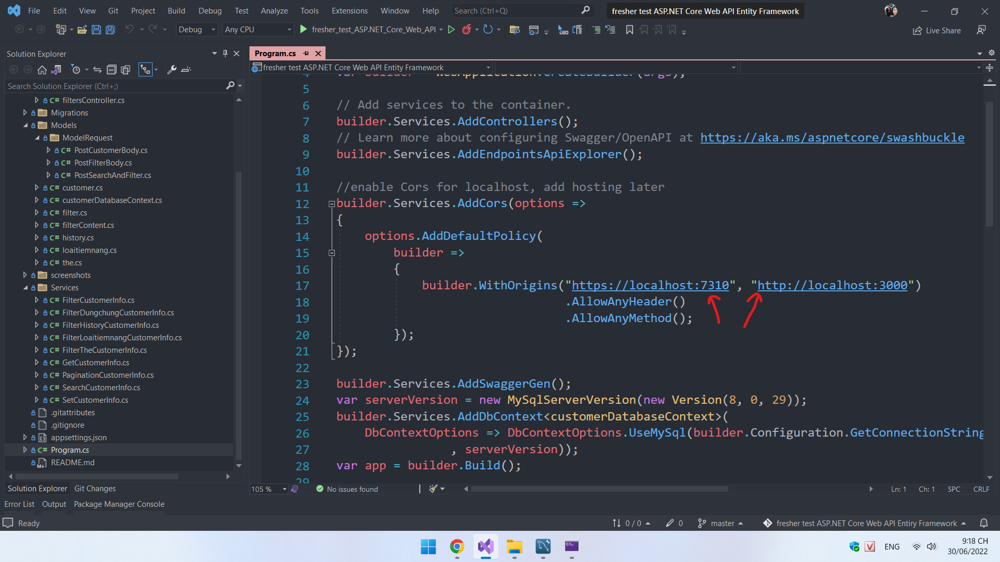
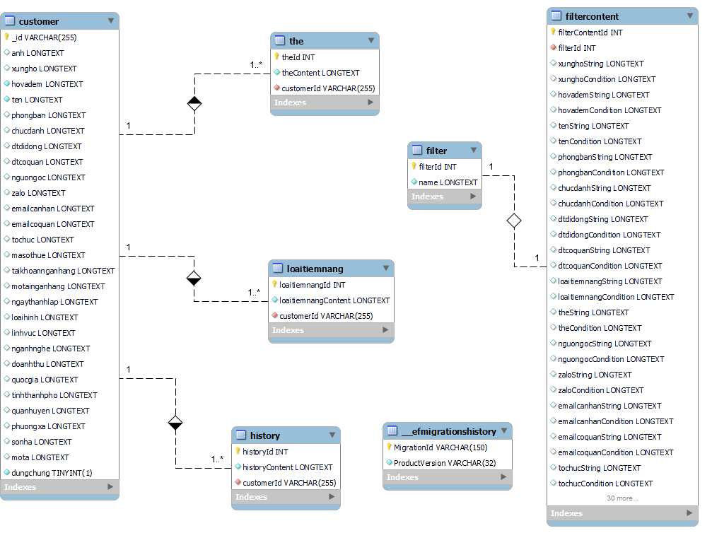
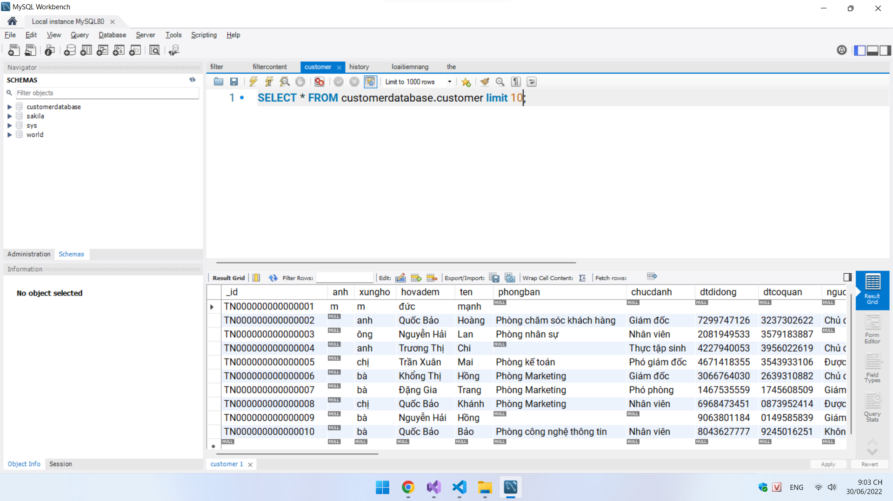

# Bài làm đề fresher test ReactJS-ASP.NET Core Web API Entity Framework-MySQL
- Phần client clone tại git này, thư mục client
https://github.com/tonguyenducmanh/fresher-test-NodeJS-ExpressJS
- Repository này chỉ bao gồm phần server, kết quả trả về hoàn toàn giống với kết quả từ server của repository fresher-test-ReactJS-ExpressJS-MongoDB

## Công cụ và công nghệ sử dụng

- API service: ASP.NET Core Web API
- Object Relational Mapper (ORM): Entity Framework
- Database: MySQL

## Test localhost
### Test Web API bằng Swagger tích hợp sẵn trong ASP.Net Core
Không dùng 1 vài phương thức mặc định như GET vì còn 
danh sách filter để lọc kết quả, thay vào đó dùng POST, ...

### Kết quả trả về dạng JSON của web development

### Kết quả trả về dạng JSON của web production

### Enable CORS tại địa chỉ client
Thay thế vị trí mũi tên màu đỏ bằng giá trị của client muốn truy cập vào web api

### Bảng thiết kế cơ sở dữ liệu

### Test truy vấn cơ sở dữ liệu customer
